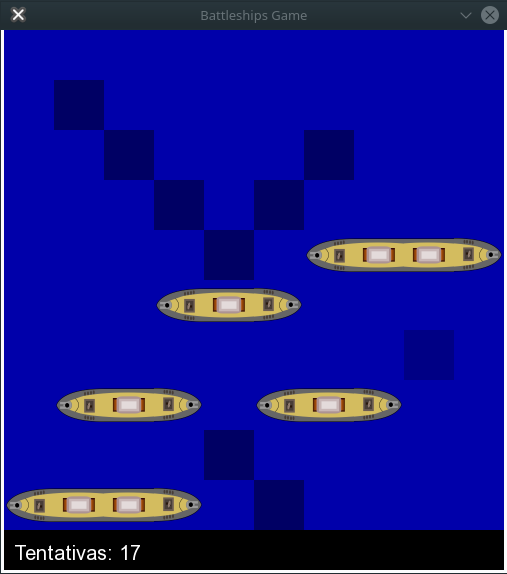

## battleships

### Ideia
Battleships é uma jogo muito conhecido tabuleiro, no qual você tem quer acertar o navio dos inimigos por meio de sua coordenada.  
A versão que eu fiz é feita em C++ 11 utilizando a biblioteca SFML.
### Requisitos  
Para gerar o executável tenha certeza que você tem instalado o ambiente de desenvolvimento C++ (`build-essential`) a biblioteca `libsfml-dev`. Além é claro de utilizar preferencialmente o `make`.  
### Como compilar
Para compiliza utilize o comando `make` ou digite `g++ -std=c++11 -Iinclude -o exec src/* -lsfml-graphics -lsfml-window -lsfml-system`.